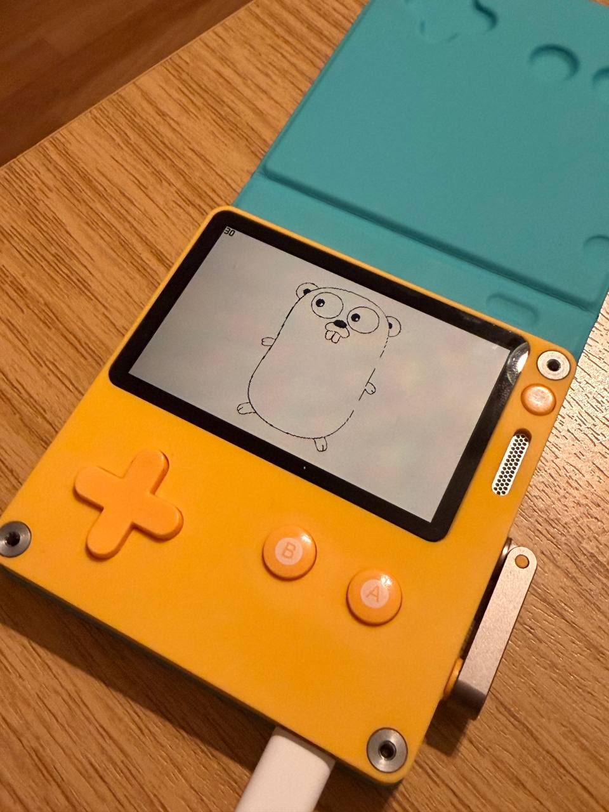

## Menu

- [Overview](#overview)
- [Community](#community)
- [CLI Tool Usage](#cli-tool-usage)
- [Internals](#internals)
    - [Device](#device)
    - [Simulator](#simulator)
- [Why Not Go But TinyGo](#why-not-go-but-tinygo)
- [Flow](#flow)
    - [Device Build](#device-build)
    - [Simulator Build](#simulator-build)
- [How To Start](#how-to-start)
- [API Bindings](#api-bindings)
- [Examples](#examples)
- [Roadmap](#roadmap)
- [Attribution](#attribution)
- [License](#license)
---

## Overview

>[!NOTE]
> This project is currently under active development, all API covered but not all features have been fully tested yet, PRs are always welcome.  
> Tested on macOS, tinygo 0.40.1 darwin/arm64, go1.25.6, LLVM 20.1.1, Playdate OS 3.0.2.

>[!NOTE]
> Playdate SDK API >= 3.0.2 is required

Hi, my name is Roman Bielyi, and I'm developing this project in my spare time as a personal initiative.
This project is an independent effort and is neither endorsed by nor affiliated with [Panic Inc](https://panic.com/).

As a Go developer, I immediately wanted to bring Go to the [Playdate](https://play.date/). It wasn’t straightforward, but I got it working -- hope you’ll enjoy experimenting with it.

## Community
Using these links and places, you can discuss the PdGo project with each other:

Slack
1) https://gophers.slack.com/archives/C029RQSEE/p1769119174451979
2) https://gophers.slack.com/archives/CDJD3SUP6/p1769119574841489

Reddit:
1) https://www.reddit.com/r/golang/comments/1qk1ec9/golang_support_for_playdate_handheld_compiler_sdk/
2) https://www.reddit.com/r/PlaydateDeveloper/comments/1qk0r60/golang_support_for_playdate_handheld_compiler_sdk/
3) https://www.reddit.com/r/programming/comments/1qk19kb/playdate_supports_go_language_compiler_sdk/
4) https://www.reddit.com/r/PlaydateConsole/comments/1qk0wy0/golang_support_for_playdate_handheld_compiler_sdk/

**Discord**:
1) https://discord.com/channels/118456055842734083/1464001888243548181
2) https://discord.com/channels/675983554655551509/1464004567476867247  

**Playdate Development Forum (this is the main place to discuss)**:
https://devforum.play.date/t/golang-support-for-playdate-compiler-sdk-bindings-tools-and-examples/24919

## CLI Tool Usage

`pdgoc` (PdGo build tool) is a command-line tool that handles **everything** for building Go apps for Playdate, both Simulator and Device builds.

> [!IMPORTANT]
> **Always use `pdgoc` for building.** Do not try to run `go build` or `tinygo build` directly because `pdgoc` handles all the complexity: SDK paths, CGO flags, temporary files, and cross-compilation.

| Flag     | Description                                       |
|----------|---------------------------------------------------|
| `sim`    | Builds project for the Playdate Simulator only    |
| `device` | Builds project for the Playdate console only      | 
| `run`    | Builds and runs project in the Playdate Simulator | 

> [!NOTE]
> The `sim` and `device` flags can be combined to build for both Simulator and Device simultaneously.

### What pdgoc Does Automatically

- **Simulator builds**: Sets up CGO environment, SDK paths, builds `.dylib`/`.so`, packages into `.pdx`
- **Device builds**: Creates C bridge, compiles with custom TinyGo, links ARM binary, packages into `.pdx`
- **Cleanup**: Removes all temporary files after build

| Flag                | Description                                     |
|---------------------|-------------------------------------------------|
| `name`              | Sets the `name` property for pdxinfo            |
| `author`            | Sets the `author` property for pdxinfo          |
| `desc`              | Sets the `description` property for pdxinfo     | 
| `bundle-id`         | Sets the `bundleID` property for pdxinfo        | 
| `version`           | Sets the `version` property for pdxinfo         |
| `build-number`      | Sets the `buildNumber` property for pdxinfo     |
| `image-path`        | Sets the `imagePath` property for pdxinfo       |
| `launch-sound-path` | Sets the `launchSoundPath` property for pdxinfo | 
| `content-warn`      | Sets the `contentWarning` property for pdxinfo  |
| `content-warn2`     | Sets the `contentWarning2` property for pdxinfo |

>[!NOTE]
> `pdxinfo` file will be created automatically during build process and removed when it's finished.

> [!NOTE]  
> To use the `pdgoc` CLI tool, navigate to the project root directory -- the one containing the `Source` folder with your `.go` source files, `go.mod`, `go.sum`, and any assets.  
> Simply execute `pdgoc` from there. It will detect the 'Source' directory automatically.
>
> **Example:**  
> If your structure looks like this:
> ```
> your-project/
> ├── Source/
> │   ├── main.go
> │   ├── go.mod
> │   ├── go.sum
> │   └── assets/ (images, sounds, etc.)
> └──
> ```  
>
> Then `cd your-project/` and run `pdgoc`.

Example:
```bash
pdgoc -device -sim \
  -name=MyApp \
  -author=YourName \
  -desc="My App" \
  -bundle-id=com.yourname.myapp \
  -version=1.0 \
  -build-number=1
```

# Internals

### Device:

For Playdate hardware `pdgoc` uses a custom [TinyGo](https://tinygo.org/) build with full Playdate hardware support instead of standard Go build tools.

**Custom GC**:  
Custom TinyGo build for Playdate achieves minimal binary sizes through custom Playdate GC:
Instead of including traditional garbage collection logic (mark, sweep, write barriers), we delegate all allocations to the Playdate SDK's `realloc` function. This results in minimal GC wrapper code in the final binary. The Playdate OS already provides a robust allocator optimized for the hardware, and we simply use it!

<details>
<summary>click to see: gc_playdate.go</summary>

```go
//go:noinline
func alloc(size uintptr, layout unsafe.Pointer) unsafe.Pointer {
    size = align(size)
    gcTotalAlloc += uint64(size)
    gcMallocs++

    ptr := _cgo_pd_realloc(nil, size)
    if ptr == nil {
        runtimePanic("out of memory")
    }

    // Zero the allocated memory
    memzero(ptr, size)
    return ptr
}

func GC() {
    // No-op - Playdate SDK manages memory
}

func SetFinalizer(obj interface{}, finalizer interface{}) {
    // No-op
}
```

</details>

**No Static Heap**:  
Standard TinyGo embedded targets reserve heap space in BSS section. Our runtime configuration eliminates this by setting `needsStaticHeap = false`.
As a result, BSS is reduced from approx. 1MB to approx. 300 bytes.

<details>
<summary>click to see: gc_playdate.go</summary>

```go
const needsStaticHeap = false

func initHeap() {
    // No initialization needed - Playdate SDK handles it
}
```

</details>

**Minimal Runtime Configuration**:  
No scheduler, no threading, no dynamic stack management. A fixed stack size of ~60KB is used instead of Go's traditional growable stacks.

<details>
<summary>click to see: playdate.json</summary>

```json
{
    "inherits": ["cortex-m"],
    "llvm-target": "thumbv7em-unknown-unknown-eabihf",
    "cpu": "cortex-m7",
    "features": "+armv7e-m,+dsp,+hwdiv,+thumb-mode,+fp-armv8d16sp,+vfp4d16sp",
    "build-tags": ["playdate", "tinygo", "gc.playdate"],
    "gc": "playdate",
    "scheduler": "none",
    "serial": "none",
    "automatic-stack-size": false,
    "default-stack-size": 61800,
    "cflags": ["-DTARGET_PLAYDATE=1", "-mfloat-abi=hard", "-mfpu=fpv5-sp-d16"]
}
```

</details>

**LLVM Optimization:**
* Target: `thumbv7em-unknown-unknown-eabihf`
* CPU: `cortex-m7` with FPU (`-mfpu=fpv5-sp-d16`, `-mfloat-abi=hard`)
* Features: Thumb-2, DSP, hardware divide, VFP4
* Dead Code Elimination: Unused functions stripped via linker script
* Link-Time Optimization: Cross-module inlining via LLVM

<details>
<summary>click to see: playdate.json & playdate.ld</summary>

**Target configuration:**

```json
{
    "llvm-target": "thumbv7em-unknown-unknown-eabihf",
    "cpu": "cortex-m7",
    "features": "+armv7e-m,+dsp,+hwdiv,+thumb-mode,+fp-armv8d16sp,+vfp4d16sp",
    "cflags": ["-DTARGET_PLAYDATE=1", "-mfloat-abi=hard", "-mfpu=fpv5-sp-d16"]
}
```

**Linker script (dead code elimination):**

```ld
ENTRY(eventHandlerShim)

SECTIONS
{
    .text : ALIGN(4) {
        KEEP(*(.text.eventHandlerShim))
        KEEP(*(.text.eventHandler))
        KEEP(*(.text.updateCallback))
        KEEP(*(.text.runtime_init))
        *(.text) *(.text.*) *(.rodata) *(.rodata.*)
        KEEP(*(.init)) KEEP(*(.fini))
        . = ALIGN(4);
    }
    ...
    /DISCARD/ : { *(.ARM.exidx*) *(.ARM.extab*) }
}
```

`/DISCARD/` removes unused ARM exception sections, `KEEP()` preserves only critical entry points.

</details>

### Simulator:

`pdgoc` uses Go's native build tools to compile apps for the Playdate Simulator.

**Under the hood, it automatically runs:**
```bash
go build -ldflags="-w -s" -gcflags="all=-l" \
  -trimpath -buildvcs=false -race=false \
  -buildmode=c-shared \
  -o "some/output" "some/input"
```

All flags are optimized: stripping debug info (`-w -s`), disabling race detector, and producing a C-shared library with `-buildmode=c-shared` needed for Simulator instead of binary executable.
In Unix systems it's `.so` and in macOS  it's `.dylib`

| Flag                  | Purpose                                                                                  |
|-----------------------|------------------------------------------------------------------------------------------|
| `-ldflags="-w -s"`    | **`-w`**: Strip debug info (DWARF). **`-s`**: Strip symbol table. Shrinks binary ~30-50% |
| `-gcflags="all=-l"`   | Disable function inlining & optimizations for simulator compatibility                    |
| `-trimpath`           | Remove local filesystem paths from binaries (security/portability)                       |
| `-buildvcs=false`     | Skip embedding VCS data (git info) - faster builds                                       |
| `-race=false`         | Explicitly disable race detector (already off by default)                                |
| `-buildmode=c-shared` | **Key**: Build as C-shared library (`.dylib`/`.so`) for Playdate Simulator               |


## Why Not Go But TinyGo

No Bare-Metal ARM Support:  
Standard Go compiler (gc) only supports these targets:

| Flag    | Purpose                     |
|---------|-----------------------------|
| linux   | amd64, arm64, arm, 386, ... |
| darwin  | amd64, arm64                |
| windows | amd64, arm64, 386           |

Playdate requires: thumbv7em-none-eabihf (ARM Cortex-M7, no OS), and this simply impossible:  
`GOOS=none GOARCH=thumbv7em go build  # not supported`

Size:  
Standard Go runtime includes Garbage Collector, Goroutine Scheduler, Stack Management and Reflection, binary size approx. 2-5 MB minimum.
Playdate constraints are 16 MB total RAM (shared with game data, graphics, sound), games let's say typically 50 KB - 2 MB.

CGO:  
It can cross-compile C code, but `CGO_ENABLED=1 GOOS=linux GOARCH=arm go build` still  full Go runtime, still requires OS, and cannot target bate metal.

| Feature            | Standard Go    | TinyGo                      |
|--------------------|----------------|-----------------------------|
| Bare-metal support | No             | Yes                         |
| GOOS= not required | No             | Yes                         |
| ARM Cortex-M       | No             | Yes thumbv7em target        |
| Minimal runtime    | No approx. 2MB | Yes approx. 1-4 KB          |
| Custom GC          | No             | Yes pluggable (gc.playdate) |
| No OS required     | No             | Yes                         |
| Relocatable code   | No             | Yes via LLVM                |

In short:

```
Go Source -> TinyGo Frontend -> LLVM IR -> LLVM Backend -> ARM Thumb-2 ELF
                                              |
                              Cortex-M7 optimizations
                              Position-independent code
                              Dead code elimination
```

Summary: Standard Go is designed for desktop/server environments, full operating systems, abundant memory (GB).
Playdate required: bare-metal ARM Cortex-M7, no operating system, tiny runtime, SDK-device-managed memory,

TinyGo bridges this gap by reimplementing Go compilation targeting embedded systems with LLVM backend.

## Flow:

### Device Build

```
┌─────────────────────────────────────────────────────────────┐
│  pdgoc -device                                              │
├─────────────────────────────────────────────────────────────┤
│  1. Create build/pd_runtime.c                               │
│  2. Create Source/bridge_template.go                        │
│  3. Create Source/main_tinygo.go                            │
│  4. Run go mod tidy                                         │
│  5. Create /tmp/device-build-*.sh                           │
│  6. Execute build script:                                   │
│     ├── Compile pd_runtime.c -> pd_runtime.o -> libpd.a     │
│     ├── Create build/playdate.ld                            │
│     ├── Create ~/tinygo-playdate/targets/playdate.json      │
│     ├── TinyGo build -> pdex.elf                            │
│     ├── pdc -> GameName_device.pdx/                         │
│     └── Delete build/ directory                             │
│  7. Delete Source/bridge_template.go                        │
│  8. Delete Source/main_tinygo.go                            │
│  9. Delete Source/pdxinfo                                   │
└─────────────────────────────────────────────────────────────┘
```
### Simulator Build

```
┌─────────────────────────────────────────────────────────────┐
│  pdgoc -sim                                                 │
├─────────────────────────────────────────────────────────────┤
│  1. Create Source/main_cgo.go                               │
│  2. go build -buildmode=c-shared -> pdex.dylib + pdex.h     │
│  3. Delete Source/pdex.h                                    │
│  4. Delete Source/main_cgo.go                               │
│  5. pdc -> GameName_sim.pdx/                                │
│  6. Delete Source/pdex.dylib                                │
│  7. Delete Source/pdxinfo                                   │
└─────────────────────────────────────────────────────────────┘
```

Temporary files created by `pdgoc` during build:

**Device Build Files**

`pd_runtime.c` - This C file acts as the bridge between the Playdate SDK and TinyGo. Since TinyGo cannot directly call C functions without CGO (which is unavailable for bare-metal targets), we create thin C wrapper functions that TinyGo can reference via //go:extern directives. This file provides _cgo_pd_realloc for memory allocation, _cgo_pd_logToConsole for debug output, and _cgo_pd_getCurrentTimeMS for timing. It also contains eventHandlerShim, which is the actual entry point that Playdate calls - this shim initializes the Go runtime before delegating to the user's Go eventHandler.

`bridge_template.go` - TinyGo needs to know how to call the pdgo API functions. This file registers function pointers from the C runtime into Go, allowing the pdgo package to invoke SDK functions like graphics->drawBitmap or system->drawFPS. Without this bridge, TinyGo would have no way to communicate with the Playdate hardware.

`main_tinygo.go` - Contains the //export eventHandler and //export updateCallback directives that tell TinyGo to expose these functions as C-callable symbols. Playdate's firmware expects to find these exact function names in the compiled binary. This file is separate from the user's main.go to avoid polluting their code with build-specific exports.

`playdate.ld` - The linker script tells the ARM linker how to arrange code and data in memory. It defines the entry point (eventHandlerShim), ensures critical functions appear at the beginning of the binary, and sets up BSS/data sections.

`playdate.json` - TinyGo's target configuration file. It specifies the CPU architecture (Cortex-M7), compiler flags, which garbage collector to use (gc.playdate), and links to the linker script. This file tells TinyGo exactly how to compile for Playdate hardware.

`libpd.a` - A static library compiled from pd_runtime.c. TinyGo links against this library to resolve the _cgo_pd_* function references. Static linking ensures all SDK wrapper code is embedded directly in the final binary.


| File                 | Location                     | Purpose                          | Cleanup                   |
|----------------------|------------------------------|----------------------------------|---------------------------|
| `pd_runtime.c`       | `build/`                     | C shim with SDK wrappers         | Deleted with `build/` dir |
| `bridge_template.go` | `Source/`                    | TinyGo API bridge registration   | Deleted after build       |
| `main_tinygo.go`     | `Source/`                    | TinyGo entry points (`//export`) | Deleted after build       |
| `device-build-*.sh`  | `/tmp/`                      | Embedded build script            | Deleted after build       |
| `playdate.ld`        | `build/`                     | Linker script                    | Deleted with `build/` dir |
| `playdate.json`      | `~/tinygo-playdate/targets/` | TinyGo target config             | Overwritten each build    |
| `pdex.elf`           | `build/`                     | Compiled ELF binary              | Deleted with `build/` dir |
| `pd_runtime.o`       | `build/`                     | Compiled C object                | Deleted with `build/` dir |
| `libpd.a`            | `build/`                     | Static C library                 | Deleted with `build/` dir |
| `pdxinfo`            | `Source/`                    | Game metadata                    | Deleted after build       |


**Simulator Build Files**

`main_cgo.go` - Similar purpose to main_tinygo.go, but uses CGO instead of TinyGo exports. Contains import "C" and //export directives that tell the standard Go compiler to generate C-callable functions. The simulator runs on your host machine (macOS/Linux), where CGO is fully supported.

`pdex.h` - Automatically generated by go build -buildmode=c-shared. This header file contains C function declarations for all exported Go functions. We immediately delete it since Playdate doesn't need it - the SDK already knows the expected function signatures.

`pdex.dylib` / `pdex.so` - The compiled shared library containing your Go game code. The Playdate Simulator dynamically loads this library at runtime and calls eventHandler when your game starts. This file is moved into the .pdx bundle by pdc.

| File                     | Location  | Purpose                       | Cleanup             |
|--------------------------|-----------|-------------------------------|---------------------|
| `main_cgo.go`            | `Source/` | CGO entry points (`//export`) | Deleted after build |
| `pdex.h`                 | `Source/` | CGO header (auto-generated)   | Deleted after build |
| `pdex.dylib` / `pdex.so` | `Source/` | Compiled shared library       | Deleted after build |
| `pdxinfo`                | `Source/` | Game metadata                 | Deleted after build |


## How To Start

You must build a custom TinyGo compiler with Playdate hardware support before using the pdgoc CLI tool.
Thankfully it's easy to do using just one `scripts/build-tinygo-playdate.sh`.

What `build-tinygo-playdate.sh` does:

The script builds a custom TinyGo compiler with Playdate support in four steps:

- Step 1: Clone TinyGo - downloads TinyGo source code from GitHub to `~/tinygo-playdate`, or updates it if already present.


- Step 2: Build LLVM - compiles LLVM from source. TinyGo uses LLVM as its compiler backend for generating optimized ARM code.


- Step 3: Add Playdate Files - injects four custom files into TinyGo:

    - playdate.json - target config (Cortex-M7, custom GC, no scheduler)
      playdate.ld
    - linker script (memory layout, entry point)
    - runtime_playdate.go - Platform runtime (time, console output via SDK)
    - gc_playdate.go - custom GC that delegates to Playdate SDK's realloc.


- Step 4: Build TinyGo - Compiles the TinyGo binary with Playdate support included.
  Result: ~/tinygo-playdate/build/tinygo - a TinyGo compiler that accepts -target=playdate and produces minimal ARM binaries (approx. 4-5 KB) for Playdate hardware.

If all went ok - you will see this (versions maybe different in you environment)

```
╔══════════════════════════════════════════════════════════╗
║                    Build Complete!                       ║
╚══════════════════════════════════════════════════════════╝

TinyGo binary: /Users/SomeUser/tinygo-playdate/build/tinygo

To use:
  export PATH="/Users/SomeUser/tinygo-playdate/build:$PATH"
  tinygo build -target=playdate -o game.elf .

tinygo version 0.40.1 darwin/arm64 (using go version go1.25.6 and LLVM version 20.1.1)
Playdate target added

```

>[!NOTE]
> On my machine - not new MacBook M1 Pro, it took approx. 25-30 minutes.

Once you have TinyGo, you need install `pdgoc`

```bash
go install https://github.com/playdate-go/cmd/pdgoc

# check installation 
pdgoc version
```

That's it! and you may forget about TinyGo (`pdgoc` will use it automatically under the hood)

>[!WARNING]
> We don't support Windows OS currently, supported: Linux, macOS.  
> You may need to wait for Windows support, or you can make a contribution.

## API Bindings
The latest full documentation for API bindings is hosted here:
https://pkg.go.dev/github.com/playdate-go/pdgo#section-documentation

## Examples

> [!NOTE]
> We will add more complex examples as the project progresses

Each example includes a `build.sh` script that runs `pdgoc` with all necessary flags.

**3D Library** -- [examples/3d_library](examples/3d_library)

```bash
cd examples/3d_library/Source 
go get github.com/playdate-go/pdgo@latest
cd ..
./build.sh
```


**Sprite Game** -- [examples/spritegame](examples/spritegame)

```bash
cd examples/spritegame/Source 
go get github.com/playdate-go/pdgo@latest
cd ..
./build.sh
```


**Conway's Game of Life** -- [examples/life](examples/life)

Is a cellular automaton developed by the British mathematician John Horton Conway.
This is a Conway's Game of Life simulation example. 

```bash
cd examples/life/Source
go get github.com/playdate-go/pdgo@latest
cd ..
./build.sh
```


**Bouncing Square** -- [examples/bouncing_square](examples/bouncing_square)

A simple application displays a black filled square that bounces continuously off all four edges of the screen.

```bash
cd examples/bouncing_square/Source
go get github.com/playdate-go/pdgo@latest
cd ..
./build.sh
```


---

**Go Logo** -- [examples/go_logo](examples/go_logo)

A simple application that displays the Go programming language's mascot, the Gopher.

```bash
cd examples/go_logo/Source
go get github.com/playdate-go/pdgo@latest
cd ..
./build.sh
```


---

**Hello World** -- [examples/hello_world](examples/hello_world)

Classic "Hello World!" text bouncing around the screen with FPS counter, this example was directly rewritten from C to Go from official Playdate SDK examples.

```bash
cd examples/hello_world/Source
go get github.com/playdate-go/pdgo@latest
cd ..
./build.sh
```


## Roadmap

- [ ] Add more own complex code examples to cover and test all API subsystems
- [ ] Rewrite to Go all official examples from SDK
    - [x] Hello World
    - [x] Life
    - [ ] Tilemap
    - [x] Sprite Game
    - [ ] Sprite Collisions
    - [ ] Particles
    - [ ] Networking
    - [ ] JSON
    - [ ] Exposure
    - [ ] Bach.mid
    - [ ] Array
    - [x] 3D Library
    - [ ] 2020
    - [ ] Accelerometer Test
    - [ ] Asteroids
    - [ ] ControllerTest
    - [ ] Drum Machine
    - [ ] Flippy Fish
    - [ ] Game Template
    - [ ] Hammer Down
    - [ ] Level 1-1
    - [ ] MIDI Player
    - [ ] Node7Driver
    - [ ] Networking
    - [ ] Pathfinder
    - [ ] Single File Examples
    - [ ] Sprite Collisions Masks
- [ ] Make sure Lua interoperability works
- [ ] Make sure C interoperability works
- [X] Write documentation for API bindings
- [ ] Create unit tests for `pdgoc` and API bindings
- [ ] Add support for Windows OS

## Attribution

The Go Gopher was designed by [Renee French](https://reneefrench.blogspot.com/)
and is licensed under [Creative Commons 4.0 Attribution License](https://creativecommons.org/licenses/by/4.0/).

## License

MIT License

Copyright (c) 2026 Roman Bielyi and PdGo contributors

Permission is hereby granted, free of charge, to any person obtaining a copy
of this software and associated documentation files (the "Software"), to deal
in the Software without restriction, including without limitation the rights
to use, copy, modify, merge, publish, distribute, sublicense, and/or sell
copies of the Software, and to permit persons to whom the Software is
furnished to do so, subject to the following conditions:

The above copyright notice and this permission notice shall be included in all
copies or substantial portions of the Software.

THE SOFTWARE IS PROVIDED "AS IS", WITHOUT WARRANTY OF ANY KIND, EXPRESS OR
IMPLIED, INCLUDING BUT NOT LIMITED TO THE WARRANTIES OF MERCHANTABILITY,
FITNESS FOR A PARTICULAR PURPOSE AND NONINFRINGEMENT. IN NO EVENT SHALL THE
AUTHORS OR COPYRIGHT HOLDERS BE LIABLE FOR ANY CLAIM, DAMAGES OR OTHER
LIABILITY, WHETHER IN AN ACTION OF CONTRACT, TORT OR OTHERWISE, ARISING FROM,
OUT OF OR IN CONNECTION WITH THE SOFTWARE OR THE USE OR OTHER DEALINGS IN THE
SOFTWARE.
