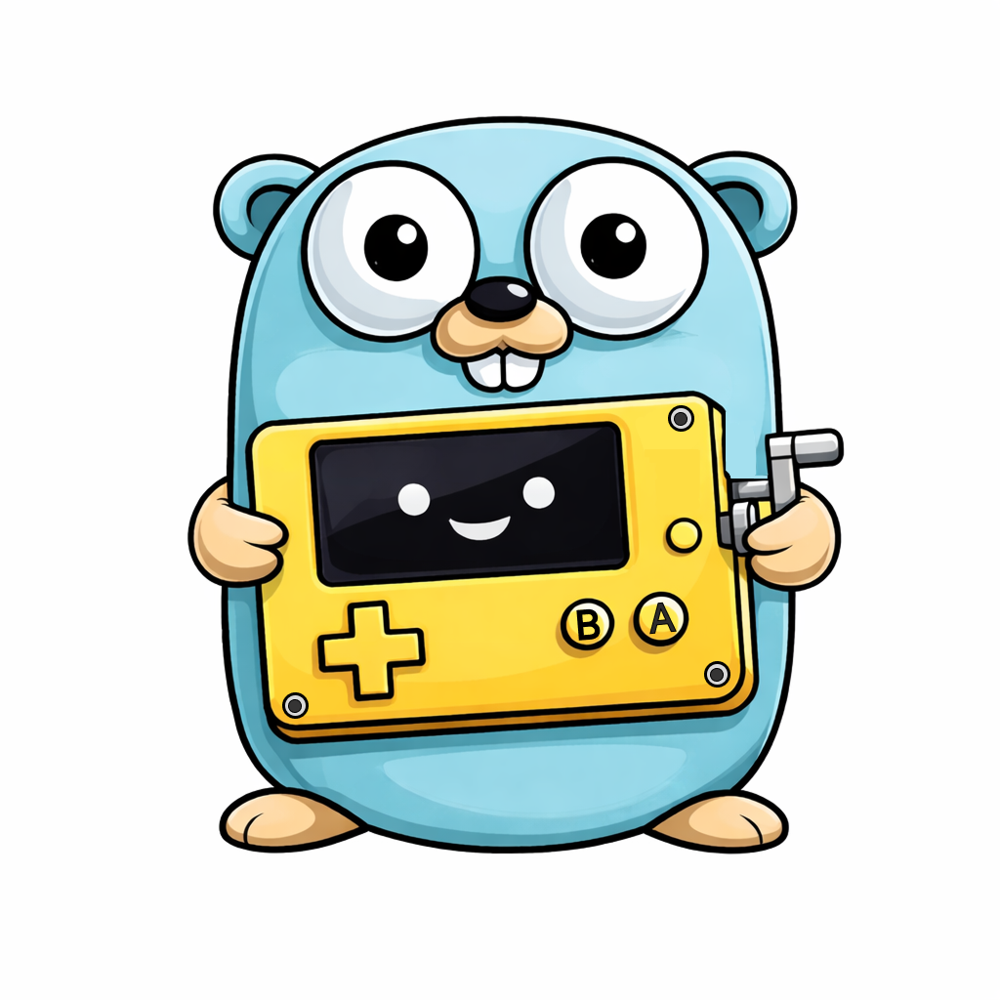
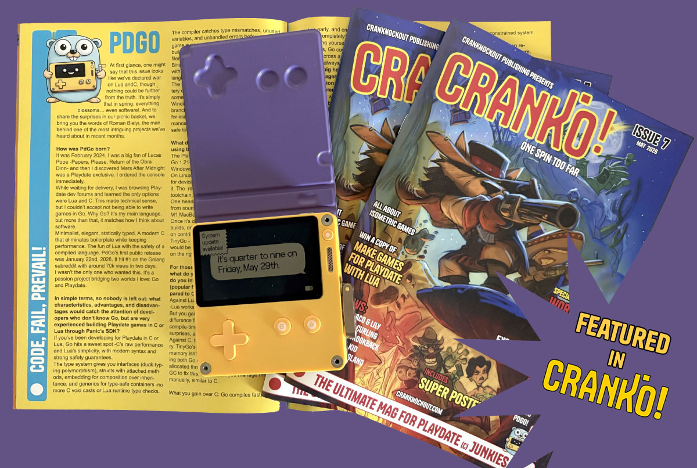

<p style="text-align: center;">
  
  
</p>

[](https://github.com/playdate-go/pdgo/actions/workflows/ci.yml)

## Menu

- [Overview](#overview)
- [Quick Install](#quick-install)
- [CLI Usage](#cli-usage)
- [Internals](#internals)
- [Why Not Go But TinyGo](#why-not-go-but-tinygo)
- [Build Flow](#build-flow)
- [Known Issues](#known-issues)
- [API Documentation](#api-documentation)
- [Examples](#examples)
- [A Tour Of Go](#a-tour-of-go)
- [Roadmap](#roadmap)
- [Contribution](#contribution)
- [Community](#community)
- [Attribution](#attribution)
- [License](#license)
---

## Overview

**PdGo** is a new development environment that allows you to create games for the [Playdate](https://play.date/) handheld gaming device using the Go programming language - for the first time ever!

Hi, my name is Roman Bielyi, and I'm developing PdGo in my spare time as a personal initiative.
This project is an independent effort and is neither endorsed by nor affiliated with [Panic Inc](https://panic.com/).

As a Go developer, I immediately wanted to bring Go to the Playdate. It wasn’t straightforward, but I got it working - hope you’ll enjoy experimenting with it.

>[!IMPORTANT]  
> This project is currently under active development. Not all APIs are covered yet, and not all features have been fully tested or implemented. PRs are always welcome.
> The main objective now is to release a stable 1.0.x version.
> To achieve this, we need to complete our tasks defined in the project's Roadmap 

## Quick Install

>[!NOTE]
> On macOS the ARM toolchain ships with the Playdate SDK, on Windows it's installed by Scoop via install.ps1, but on Linux there's no built-in source - so you need to install it manually using `sudo apt install gcc-arm-none-eabi`  

### For nacOS and Linux

```bash
curl -fsSL https://raw.githubusercontent.com/playdate-go/pdgo/main/install.sh | bash
```

### Windows

```powershell
iwr -useb https://raw.githubusercontent.com/playdate-go/pdgo/main/install.ps1 | iex
```

The Windows installer uses [Scoop](https://scoop.sh) to manage dependencies, and will install it automatically if not present.

If you have issues with the installer, create an issue [here](https://github.com/playdate-go/pdgo/issues).

Log out and login back to ensure paths are properly updated.


This installs **everything** you need:
- Dependencies
- `pdgoc` - the build tool
- Prebuilt`TinyGo` binary with custom Playdate support (for device builds)
- Configures your PATH automatically


### Installation Modes

The install script automatically detects how it's being run and adjusts accordingly:

| Mode | How to Run | pdgoc Source | Playdate Patches | Use Case |
|------|-----------|--------------|------------------|----------|
| **Local** | `./install.sh` from repo root | Local `cmd/pdgoc/` | Local `cmd/pdgoc/tinygo-patches/` | Development & testing |
| **Remote** | `curl` ... \ `iwr` ... | `bash` / `ps` | GitHub tarball | GitHub raw URLs | Production installation |

**Local Mode Benefits:**
- Build from local source - test your changes before committing
- Use local patch files - faster, no network needed
- Get accurate version info from local git

The installer automatically detects which mode to use by checking for `cmd/pdgoc/` directory and `go.mod` file in the current directory.

### What the installer does

1. **Installs dependencies** (platform-specific):
   - **Playdate SDK**: downloads and installs automatically if not found (set `PLAYDATE_SDK_PATH` to override default location)
   - **Windows only**: installs Scoop (package manager) and all required dependencies automatically via Scoop: `go`, `git`, `mingw` (for simulator CGO builds), `gcc-arm-none-eabi` (for device builds)
2. **Installs pdgoc** - builds from source with version info injected
3. **Downloads TinyGo** - downloads the official pre-compiled TinyGo v0.40.1 release for your OS/arch to `~/tinygo-playdate`
4. **Adds Playdate support** - injects custom files into TinyGo:
   - `playdate.json` - target config (Cortex-M7, custom GC, no scheduler)
   - `playdate.ld` - linker script (memory layout, entry point)
   - `runtime_playdate.go` - platform runtime (time, console output via SDK)
   - `gc_playdate.go` - leaking GC type (heap allocations never reclaimed unless manually freed, GC will be implemented later, please see https://github.com/playdate-go/pdgo/issues/6)
5. **Configures PATH** - adds `pdgoc` and `tinygo` to your shell

Result: `~/tinygo-playdate/bin/tinygo` - a TinyGo compiler that accepts `-target=playdate`


>[!IMPORTANT]
> The patches are **not** compiled into the `tinygo` binary itself - they are loose source files that TinyGo picks up and compiles on every build. This means you get a fully working Playdate toolchain in a few minutes instead of building TinyGo from source (dozens of minutes, in example approx. 8-9 minutes on MacBook Pro M5 Pro (15 CPUs) ).

---

## CLI Usage

`pdgoc` is a command-line tool that handles **everything** for building for the Playdate, both Simulator and Device builds.

> [!IMPORTANT]  
> **Always use `pdgoc` for building.** Do not try to run `go build` or `tinygo build` directly because `pdgoc` handles all the complexity: SDK paths, CGO flags, temporary files, etc.

> [!TIP]  
> The `sim` and `device` flags can be combined to build for both Simulator and Device simultaneously.

| Flag     | Description                                                   |
|----------|---------------------------------------------------------------|
| `sim`    | Builds project for the Playdate Simulator only                |
| `device` | Builds project for the Playdate console only                  | 
| `run`    | Builds and runs project in the Playdate Simulator             |
| `deploy` | Deploys and runs on connected Playdate device (requires `-device`) | 


| Flag                | Description                                     |
|---------------------|-------------------------------------------------|
| `name`              | Sets the `name` property for pdxinfo            |
| `author`            | Sets the `author` property for pdxinfo          |
| `desc`              | Sets the `description` property for pdxinfo     | 
| `bundle-id`         | Sets the `bundleID` property for pdxinfo        | 
| `version`           | Sets the `version` property for pdxinfo         |
| `build-number`      | Sets the `buildNumber` property for pdxinfo     |
| `image-path`        | Sets the `imagePath` property for pdxinfo       |
| `launch-sound-path` | Sets the `launchSoundPath` property for pdxinfo | 
| `content-warn`      | Sets the `contentWarning` property for pdxinfo  |
| `content-warn2`     | Sets the `contentWarning2` property for pdxinfo |


> [!NOTE]  
> To use the `pdgoc` CLI tool, navigate to the project root directory -- the one containing the `Source` folder with your `.go` source files, `go.mod`, `go.sum`, and any assets.  
> Simply execute `pdgoc` from there. It will detect the 'Source' directory automatically.
>
> **Example:**  
> If your structure looks like this:
> ```
> your-project/
> ├── Source/
> │   ├── main.go
> │   ├── go.mod
> │   ├── go.sum
> │   └── assets/ (images, sounds, etc.)
> └──
> ```  
>
> Then `cd your-project/` and run `pdgoc`.

Example:
```bash
pdgoc -device -sim \
  -name=MyApp \
  -author=YourName \
  -desc="My App" \
  -bundle-id=com.yourname.myapp \
  -version=1.0 \
  -build-number=1
```

The `main.go`:

```go
package main

import (
	"github.com/playdate-go/pdgo"
)

// A global pointer to the Playdate API. 
//Initialized automatically when the game starts. 
//All SDK calls go through this variable: pd.Graphics.DrawText(...), pd.System.DrawFPS(...), etc.
var pd *pdgo.PlaydateAPI


// Called once when the game launches (during kEventInit).
// Use this to load images, sounds, fonts, and initialize your game state. The Playdate API (pd) is fully available here.
func initGame() {
	
}

// The main game loop. Called every frame (~30 FPS by default). Here you:
// Handle input (pd.System.GetButtonState())
// Update game logic
// Draw graphics (pd.Graphics.DrawText(), pd.Graphics.DrawBitmap())
// Return value: 1 to tell Playdate the display was updated and needs refresh. Return 0 if nothing changed (saves battery).
func update() int {
	
}

// Must exist but remains empty. 
//Playdate doesn't use Go's normal main() entry point, instead, the SDK calls eventHandler which is generated by pdgoc
func main() {}

```

# Internals

### Installer:

Unlike standard Go where the runtime is baked into the compiler binary, **TinyGo keeps its runtime as plain `.go` source files on disk** (`src/runtime/*.go`). Every time you run `tinygo build`, the compiler reads and compiles those runtime sources fresh as part of your project.

This is what makes the Playdate support strategy possible:

```
1. Download official TinyGo release (pre-compiled binary for your platform)
                          │
                          ▼
2. Inject Playdate patches into the TinyGo directory:
   ├── targets/playdate.json        ← target config (read at build time)
   ├── targets/playdate.ld          ← linker script (read at build time)
   ├── src/runtime/runtime_playdate.go  ← platform runtime: time, console output, runtime_init entry point (compiled per build)
   └── src/runtime/gc_playdate.go       ← Playdate GC: heap alloc via _cgo_pd_realloc, leaking (no-op GC, manual free required)
                          │
                          ▼
3. When you build a game (pdgoc -device):
   TinyGo reads targets/playdate.json
       → compiles src/runtime/runtime_playdate.go + gc_playdate.go
       → compiles your game code
       → generates C runtime wrapper (pd_runtime.c) with CGO bindings to Playdate C API
       → arm-none-eabi-gcc compiles pd_runtime.c to pd_runtime.o (with Cortex-M7 flags)
       → arm-none-eabi-ar creates libpd.a static library from pd_runtime.o
       → TinyGo links against libpd.a using playdate.ld linker script
       → arm-none-eabi-gcc compiles SDK setup.c (C_API/buildsupport/setup.c)
       → arm-none-eabi-gcc links setup.o + pd_runtime.o + game.o into pdex.elf (ARM binary)
       → pdc packages pdex.elf + game assets into final .pdx bundle
```

### Device:


**Custom GC**:  
Currently uses "leaking" GC type–heap allocations from both Go and the Playdate C API are never reclaimed unless you free them manually.

This isn't the goal. We're building a conservative mark-and-sweep GC designed for Playdate's constraints:
- Tracks Go-level objects conservatively, integrated with the SDK allocator.
- Uses a finalizers pattern to automatically free C-level API objects (bitmaps, sprites, sounds) when they become unreachable – managing both heaps in one system.
- Lightweight stop-the-world pauses, lighter than Go's stock tri-color GC, tuned for a constrained system.

The priority is making it work reliably. Concrete specifications will follow. Once stable, the headache shifts from manual frees to what every Go developer already handles on constrained systems: keeping heap churn low. A much better problem to have.

Follow this link to the progress https://github.com/playdate-go/pdgo/issues/6: 

<details>
<summary>click to see: gc_playdate.go</summary>

```go
//go:noinline
func alloc(size uintptr, layout unsafe.Pointer) unsafe.Pointer {
    size = align(size)
    gcTotalAlloc += uint64(size)
    gcMallocs++

    ptr := _cgo_pd_realloc(nil, size)
    if ptr == nil {
        runtimePanic("out of memory")
    }

    // Zero the allocated memory
    memzero(ptr, size)
    return ptr
}

func GC() {
    // No-op - leaking GC, manual free required
}

func SetFinalizer(obj interface{}, finalizer interface{}) {
    // No-op
}
```

</details>

**No Static Heap**:  
Standard TinyGo embedded targets reserve heap space in BSS section. Our runtime configuration eliminates this by setting `needsStaticHeap = false`.
As a result, BSS is reduced from approx. 1MB to approx. 300 bytes.

<details>
<summary>click to see: gc_playdate.go</summary>

```go
const needsStaticHeap = false

func initHeap() {}
```

</details>

**Minimal Runtime Configuration**:  
No scheduler, no threading, no dynamic stack management. A fixed stack size of 128KB is used instead of Go's traditional growable stacks.

<details>
<summary>click to see: playdate.json</summary>

```json
{
    "inherits": ["cortex-m"],
    "llvm-target": "thumbv7em-unknown-unknown-eabihf",
    "cpu": "cortex-m7",
    "features": "+armv7e-m,+dsp,+hwdiv,+thumb-mode,+fp-armv8d16sp,+vfp4d16sp",
    "build-tags": ["playdate", "tinygo", "gc.playdate"],
    "gc": "playdate",
    "scheduler": "none",
    "serial": "none",
    "automatic-stack-size": false,
    "default-stack-size": 131072,
    "cflags": ["-DTARGET_PLAYDATE=1", "-mfloat-abi=hard", "-mfpu=fpv5-sp-d16"]
}
```

</details>

**LLVM Optimization:**
* Target: `thumbv7em-unknown-unknown-eabihf`
* CPU: `cortex-m7` with FPU (`-mfpu=fpv5-sp-d16`, `-mfloat-abi=hard`)
* Features: Thumb-2, DSP, hardware divide, VFP4
* Unused code stripped via `--gc-sections` linker flag combined with `-ffunction-sections -fdata-sections` compiler flags

<details>
<summary>click to see: playdate.json & playdate.ld</summary>

**Target configuration:**

```json
{
    "llvm-target": "thumbv7em-unknown-unknown-eabihf",
    "cpu": "cortex-m7",
    "features": "+armv7e-m,+dsp,+hwdiv,+thumb-mode,+fp-armv8d16sp,+vfp4d16sp",
    "cflags": ["-DTARGET_PLAYDATE=1", "-mfloat-abi=hard", "-mfpu=fpv5-sp-d16"]
}
```

**Linker script (dead code elimination):**

```ld
ENTRY(eventHandlerShim)

SECTIONS
{
    .text : ALIGN(4) {
        KEEP(*(.text.eventHandlerShim))
        KEEP(*(.text.eventHandler))
        KEEP(*(.text.updateCallback))
        KEEP(*(.text.runtime_init))
        *(.text) *(.text.*) *(.rodata) *(.rodata.*)
        KEEP(*(.init)) KEEP(*(.fini))
        . = ALIGN(4);
    }
    ...
    /DISCARD/ : { *(.ARM.exidx*) *(.ARM.extab*) }
}
```

`/DISCARD/` removes unused ARM exception sections, `KEEP()` prevents critical entry points from being stripped by `--gc-sections`.

</details>

### Simulator:

`pdgoc` uses Go's native build tools to compile apps for the Playdate Simulator.

**Under the hood, it automatically runs:**
```bash
go build -ldflags="-w -s" -gcflags="all=-l" \
  -trimpath -buildvcs=false -race=false \
  -buildmode=c-shared \
  -o "some/output" "some/input"
```

All flags are optimized: stripping debug info (`-w -s`), disabling race detector, and producing a C-shared library with `-buildmode=c-shared` needed for Simulator instead of binary executable.
In Unix systems it's `.so`, in macOS  it's `.dylib`, in Windows it's `.dll` '

| Flag                  | Purpose                                                                                  |
|-----------------------|------------------------------------------------------------------------------------------|
| `-ldflags="-w -s"`    | **`-w`**: Strip debug info (DWARF). **`-s`**: Strip symbol table. Shrinks binary ~30-50% |
| `-gcflags="all=-l"`   | Disable function inlining & optimizations for simulator compatibility                    |
| `-trimpath`           | Remove local filesystem paths from binaries (security/portability)                       |
| `-buildvcs=false`     | Skip embedding VCS data (git info) - faster builds                                       |
| `-race=false`         | Explicitly disable race detector (already off by default)                                |
| `-buildmode=c-shared` | **Key**: Build as C-shared library (`.dylib`/`.so` / `.dll`) for Playdate Simulator               |


## Why Not Go But TinyGo

No Bare-Metal ARM Support:  
Standard Go compiler (gc) only supports these targets:

| Flag    | Purpose                     |
|---------|-----------------------------|
| linux   | amd64, arm64, arm, 386, ... |
| darwin  | amd64, arm64                |
| windows | amd64, arm64, 386           |

Playdate requires: thumbv7em-none-eabihf (ARM Cortex-M7, no OS), and this is simply impossible:  
`GOOS=none GOARCH=thumbv7em go build  # not supported`

Size:  
Standard Go runtime includes Garbage Collector, Goroutine Scheduler, Stack Management and Reflection, binary size approx. 2-5 MB minimum.
Playdate constraints are 16 MB total RAM (shared with game data, graphics, sound), games typically 50 KB - 2 MB.

| Feature            | Standard Go    | TinyGo                      |
|--------------------|----------------|-----------------------------|
| Bare-metal support | No             | Yes                         |
| GOOS= not required | No             | Yes                         |
| ARM Cortex-M       | No             | Yes thumbv7em target        |
| Minimal runtime    | No approx. 2MB | Yes approx. 1-4 KB          |
| Custom GC          | No             | Yes pluggable (gc.playdate) |
| No OS required     | No             | Yes                         |
| Relocatable code   | No             | Yes via LLVM                |
| CGO on bare-metal  | No             | Yes (with custom runtime)   |

In short:

```
Go Source -> TinyGo Frontend -> LLVM IR -> LLVM Backend -> ARM Thumb-2 ELF
                                              |
                              Cortex-M7 optimizations
                              Position-independent code
                              Dead code elimination
```

Summary: Standard Go is designed for desktop/server environments, full operating systems, abundant memory (GB).
Playdate requires: bare-metal ARM Cortex-M7, no operating system, tiny runtime, and manual memory management (conservative mark-and-sweep GC planned).

TinyGo bridges this gap by reimplementing Go compilation targeting embedded systems with LLVM backend. We use the official TinyGo release with injected patches (target config, linker script, runtime, GC) to support CGO on bare-metal Playdate hardware through a unified C wrapper layer (`pd_cgo.c`).

## Build Flow:

### Device

```
┌─────────────────────────────────────────────────────────────┐
│  pdgoc -device                                              │
├─────────────────────────────────────────────────────────────┤
│  1. Copy pd_cgo.c from pdgo module to build/pd_runtime.c    │
│  2. Create Source/main_tinygo.go                            │
│  3. Run go mod tidy                                         │
│  4. Create /tmp/device-build-*.sh                           │
│  5. Execute build script:                                   │
│     ├── Compile pd_runtime.c -> pd_runtime.o -> libpd.a     │
│     ├── Create build/playdate.ld                            │
│     ├── Create ~/tinygo-playdate/targets/playdate.json      │
│     ├── TinyGo build -> pdex.elf                            │
│     ├── pdc -> GameName.pdx/                                │
│     └── Delete build/ directory                             │
│  6. Delete Source/main_tinygo.go                            │
│  7. Delete Source/pdxinfo                                   │
└─────────────────────────────────────────────────────────────┘
```
### Simulator

```
┌─────────────────────────────────────────────────────────────┐
│  pdgoc -sim                                                 │
├─────────────────────────────────────────────────────────────┤
│  1. Create Source/main_cgo.go                               │
│  2. go build -buildmode=c-shared -> pdex.dylib + pdex.h     │
│  3. Delete Source/pdex.h                                    │
│  4. Delete Source/main_cgo.go                               │
│  5. pdc -> GameName_sim.pdx/                                │
│  6. Delete Source/pdex.dylib                                │
│  7. Delete Source/pdxinfo                                   │
└─────────────────────────────────────────────────────────────┘
```

Temporary files created by `pdgoc` during build:

**Device Build Files**

`pd_runtime.c` - Copied from `pd_cgo.c` in the pdgo module. This C file provides all Playdate SDK wrappers that Go code calls via CGO. It includes TinyGo runtime support functions (`_cgo_pd_realloc`, `_cgo_pd_logToConsole`, `_cgo_pd_getCurrentTimeMS`) and the `eventHandler` entry point. Compiled with `-DTARGET_PLAYDATE=1` to enable device-specific code.

`main_tinygo.go` - Contains the `//export go_init` and `//export go_update` directives that tell TinyGo to expose these functions as C-callable symbols. The C runtime calls these functions to initialize the game and run the update loop. This file is separate from the user's main.go to avoid polluting their code with build-specific exports.

`playdate.ld` - The linker script tells the ARM linker how to arrange code and data in memory. It defines the entry point (eventHandlerShim), ensures critical functions appear at the beginning of the binary, and sets up BSS/data sections.

`playdate.json` - TinyGo's target configuration file. It specifies the CPU architecture (Cortex-M7), compiler flags, which garbage collector to use (gc.playdate), and links to the linker script. This file tells TinyGo exactly how to compile for Playdate hardware.

`libpd.a` - A static library compiled from pd_runtime.c. TinyGo links against this library to resolve the C function references. Static linking ensures all SDK wrapper code is embedded directly in the final binary.


| File                 | Location                     | Purpose                          | Cleanup                   |
|----------------------|------------------------------|----------------------------------|---------------------------|
| `pd_runtime.c`       | `build/`                     | C wrappers (copy of pd_cgo.c)    | Deleted with `build/` dir |
| `main_tinygo.go`     | `Source/`                    | TinyGo entry points (`//export`) | Deleted after build       |
| `device-build-*.sh`  | `/tmp/`                      | Embedded build script            | Deleted after build       |
| `playdate.ld`        | `build/`                     | Linker script                    | Deleted with `build/` dir |
| `playdate.json`      | `~/tinygo-playdate/targets/` | TinyGo target config             | Overwritten each build    |
| `pdex.elf`           | `build/`                     | Compiled ELF binary              | Deleted with `build/` dir |
| `pd_runtime.o`       | `build/`                     | Compiled C object                | Deleted with `build/` dir |
| `libpd.a`            | `build/`                     | Static C library                 | Deleted with `build/` dir |
| `pdxinfo`            | `Source/`                    | Game metadata                    | Deleted after build       |


**Simulator Build Files**

The simulator build uses the same `pd_cgo.c` from the pdgo module as the device build, but compiled for the host architecture. The C wrappers are linked directly into the shared library via standard Go CGO.

`main_cgo.go` - Contains `import "C"` and `//export eventHandler` directive that tells the standard Go compiler to generate a C-callable entry point. The simulator runs on your host machine (macOS/Linux), where CGO is fully supported.

`pdex.h` - Automatically generated by go build -buildmode=c-shared. This header file contains C function declarations for all exported Go functions. We immediately delete it since Playdate doesn't need it - the SDK already knows the expected function signatures.

`pdex.dylib` / `pdex.so` / `pdex.dll` - The compiled shared library containing your Go game code and the C wrappers. The Playdate Simulator dynamically loads this library at runtime and calls eventHandler when your game starts. This file is moved into the .pdx bundle by pdc.

| File                     | Location  | Purpose                       | Cleanup             |
|--------------------------|-----------|-------------------------------|---------------------|
| `main_cgo.go`            | `Source/` | CGO entry points (`//export`) | Deleted after build |
| `pdex.h`                 | `Source/` | CGO header (auto-generated)   | Deleted after build |
| `pdex.dylib` / `pdex.so` / `pdex.dll` | `Source/` | Compiled shared library       | Deleted after build |
| `pdxinfo`                | `Source/` | Game metadata                 | Deleted after build |


## Known Issues: 

Two confirmed crash-causing patterns in TinyGo's `fmt` package when targeting ARM Thumb (Playdate device). Both work fine in the Simulator (standard Go) but crash immediately on device.

### Bug 1: `fmt.Sprintf("%v", slice)` — reflection on slices

```go
// CRASHES on device:
fmt.Sprintf("%v", []int{1, 2, 3})

// FIX — manual string building:
func joinInts(s []int) string {
    r := "["
    for i, v := range s {
        if i > 0 { r += "," }
        r += fmt.Sprint(v)
    }
    return r + "]"
}
```

The `%v` format verb uses reflection to iterate slice elements, which is broken in TinyGo on ARM.

### Bug 2: `fmt.Sprint(customStringerType)` — fmt.Stringer interface assertion

```go
// CRASHES on device:
type myString string
func (m myString) String() string { return string(m) }
fmt.Sprint(myString("test"))

// FIX — call String() directly:
string(myString("test"))
// or
myString("test").String()
```

TinyGo's `fmt` package internally checks if a value implements `fmt.Stringer`. This interface assertion is broken on ARM Thumb.

### General Rule

On TinyGo ARM/Playdate: only use `fmt.Sprintf`/`fmt.Sprint` with **basic concrete types** (`int`, `string`, `bool`, `float64` with basic format verbs like `%d`, `%s`, `%t`, `%.1f`). Never pass slices, maps, or custom types implementing interfaces to any `fmt` function.

---

## API Documentation
The latest full documentation for API bindings is hosted here:
https://pkg.go.dev/github.com/playdate-go/pdgo#section-documentation

## Examples

> [!NOTE]
> We will add more complex examples as the project progresses

To build all examples please do this:

### For macOS and Linux

```bash
# in project repo root
chmod +x game_examples/build_all.sh 
chmod +x game_examples/*/build.sh
./game_examples/build_all.sh
```

### For Windows
```powershell
cd game_examples
build_all.ps1
```

Each example includes a `build.sh` script that runs `pdgoc` with all necessary flags.

**Particles** -- [game_examples/particles](game_examples/particles)

**Exposure** -- [game_examples/exposure](game_examples/exposure)

**Sprite Collisions** -- [game_examples/sprite_collisions](game_examples/sprite_collisions)

**Tilemap** -- [game_examples/tilemap](game_examplestilemap)

**JSON High and Low Level Encoding and Decoding** -- [game_examples/json](game_examples/json) | [examples/json_lowlevel](examples/json_lowlevel)

**Bach MIDI** -- [game_examples/bach_midi](game_examples/bach_midi)

**3D Library** -- [game_examples/3d_library](game_examples/3d_library)

**Sprite Game** -- [game_examples/spritegame](game_examples/spritegame)

**Conway's Game of Life** -- [game_examples/life](game_examples/life)

**Bouncing Square** -- [game_examples/bouncing_square](game_examples/bouncing_square)

**Go Logo** -- [game_examples/go_logo](game_examples/go_logo)

**Hello World** -- [game_examples/hello_world](game_examples/hello_world)


## A Tour Of Go

The official Go language tutorial — [A Tour of Go](https://go.dev/tour/) — has been adapted to run on Playdate with PdGo, out of the box, on both the Simulator and the device.

If you are coming from C or Lua gamedev and want to learn Go, this is the fastest way to try every language feature hands-on: packages, functions, control flow, pointers, structs, arrays, slices, maps, closures, methods, interfaces, type assertions, generics, errors, and io.Reader — all running directly on Playdate hardware.

All examples are located in the `tour_of_go/` directory. Each example is a self-contained PdGo project with its own `build.sh`.

### For macOS and Linux

**Build all examples at once:**
```bash
cd tour_of_go
chmod +x build_all.sh
chmod +x */build.sh
./build_all.sh
```

### For Windows

```powershell
cd tour_of_go
.\build_all.ps1
```

The examples cover Go fundamentals (01-26), pointers and structs (27-32), slices (33-41), maps (44-47), functions and closures (48-49), methods (50-57), interfaces (58-62), type assertions and switches (64-65), Stringer (66), errors (67), io.Reader (68), and generics (`generics_type_parameters`, `generics_generic_types`, `generics_all`).

All examples are device-tested and avoid [known TinyGo ARM fmt issues](#known-issues-).

---

## Roadmap

- [ ] Add more own complex code examples to cover and test all API subsystems
- [ ] Rewrite to Go all official examples from SDK
    - [x] Hello World
    - [x] Life
    - [x] Tilemap
    - [x] Sprite Game
    - [x] Sprite Collisions
    - [x] Particles
    - [x] Networking
    - [x] JSON
    - [x] Exposure
    - [x] Bach.mid
    - [ ] Array
    - [x] 3D Library
    - [ ] 2020
    - [ ] Accelerometer Test
    - [ ] Asteroids
    - [ ] ControllerTest
    - [ ] Drum Machine
    - [ ] Flippy Fish
    - [ ] Game Template
    - [ ] Hammer Down
    - [ ] Level 1-1
    - [ ] MIDI Player
    - [ ] Node7Driver
    - [ ] Networking
    - [ ] Pathfinder
    - [ ] Single File Examples
    - [ ] Sprite Collisions Masks
- [ ] Make sure Lua interoperability works
- [ ] Make sure C interoperability works
- [X] Write documentation for API bindings
- [x] Add Go-Tour like code examples to demostrate language's syntax and semantic to newcomers  
- [ ] Add different benchmarks to compare Go with C and Lua
- [ ] Investigate: concurrency: goroutines/scheduler support for single-threaded CPU
- [ ] Implement conservative mark-and-sweep GC for Playdate's constraints
- [ ] Create unit tests for `pdgoc` and API bindings
- [x] Add support for Windows OS

## Contribution
```bash
# 1. Fork the repo on GitHub first (via the web UI), then:

git clone https://github.com/<your-github-username>/pdgo.git
cd pdgo

# 2. Make sure you are on the main branch
git checkout main
git pull origin main

# 3. Create a feature branch based on main
git checkout -b my_feature

# 4. Make your changes, then stage only what you need
git add path/to/changed_file.go   # or several files

# 5. Commit with a meaningful message
git commit -m "Describe what this change does"

# 6. Push your branch to your fork
git push origin my_feature

#Go to your fork on GitHub, you’ll see a banner offering to “Compare & pull request”.

# Open a pull request from my_feature in your fork to playdate-go/pdgo’s main (or whichever target branch you use).
```

### For macOS and Linux

Verify unit tests pass 
```bash
cd cmd/pdgoc
go test ./config/... ./pdxinfo/... -v
```

Verify all examples compile
```bash
chmod +x game_examples/build_all.sh 
chmod +x game_examples/*/build.sh
./game_examples/build_all.sh
```

```bash
chmod +x tour_of_go/build_all.sh
chmod +x tour_of_go/*/build.sh
./tour_of_go/build_all.sh
```

### For Windows

```powershell
cd cmd/pdgoc
go test ./config/... ./pdxinfo/... -v
```

```powershell
cd game_examples
build_all.ps1
```

```powershell
cd tour_of_go
build_all.ps1
```

## Community
Using these links and places, you can discuss the PdGo project with each other:

Slack
1) https://gophers.slack.com/archives/C029RQSEE/p1769119174451979
2) https://gophers.slack.com/archives/CDJD3SUP6/p1769119574841489

Reddit:
1) https://www.reddit.com/r/golang/comments/1qk1ec9/golang_support_for_playdate_handheld_compiler_sdk/
2) https://www.reddit.com/r/PlaydateDeveloper/comments/1qk0r60/golang_support_for_playdate_handheld_compiler_sdk/
3) https://www.reddit.com/r/programming/comments/1qk19kb/playdate_supports_go_language_compiler_sdk/
4) https://www.reddit.com/r/PlaydateConsole/comments/1qk0wy0/golang_support_for_playdate_handheld_compiler_sdk/

**Discord**:
1) https://discord.com/channels/118456055842734083/1464001888243548181
2) https://discord.com/channels/675983554655551509/1464004567476867247

**Playdate Development Forum (this is the main place to discuss)**:
https://devforum.play.date/t/golang-support-for-playdate-compiler-sdk-bindings-tools-and-examples/24919

## Attribution

The Go Gopher was designed by [Renee French](https://reneefrench.blogspot.com/)
and is licensed under [Creative Commons 4.0 Attribution License](https://creativecommons.org/licenses/by/4.0/).

## License

MIT License

Copyright (c) 2026 Roman Bielyi and PdGo contributors

Permission is hereby granted, free of charge, to any person obtaining a copy
of this software and associated documentation files (the "Software"), to deal
in the Software without restriction, including without limitation the rights
to use, copy, modify, merge, publish, distribute, sublicense, and/or sell
copies of the Software, and to permit persons to whom the Software is
furnished to do so, subject to the following conditions:

The above copyright notice and this permission notice shall be included in all
copies or substantial portions of the Software.

THE SOFTWARE IS PROVIDED "AS IS", WITHOUT WARRANTY OF ANY KIND, EXPRESS OR
IMPLIED, INCLUDING BUT NOT LIMITED TO THE WARRANTIES OF MERCHANTABILITY,
FITNESS FOR A PARTICULAR PURPOSE AND NONINFRINGEMENT. IN NO EVENT SHALL THE
AUTHORS OR COPYRIGHT HOLDERS BE LIABLE FOR ANY CLAIM, DAMAGES OR OTHER
LIABILITY, WHETHER IN AN ACTION OF CONTRACT, TORT OR OTHERWISE, ARISING FROM,
OUT OF OR IN CONNECTION WITH THE SOFTWARE OR THE USE OR OTHER DEALINGS IN THE
SOFTWARE.
